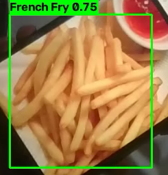

# Junk Food Object Detection

A comparative and analytical study of deep learning-based object detection systems for junk food identification. This project goes beyond a simple single-model transfer learning approach by incorporating multi-model comparison, augmentation analysis, generalization testing, **and a full production-grade deployment pipeline**.

---

## 📁 Repository Structure

```
Junk-Food-Object-Detection/
├── training/              # Model training & experimentation (Project 1)
│   ├── yolov8/
│   ├── faster_rcnn/
│   ├── detr/
│   └── notebook_*.py
│
└── deployment/            # Production deployment pipeline (Project 2)
    ├── model/              # ONNX export + INT8 quantization scripts
    ├── app/                # Detector class + FastAPI service
    ├── benchmark/          # Model comparison (speed/size)
    ├── demo/               # Real-time video stream demo
    └── tests/              # pytest test suite
```

`training/` covers the research side — comparing detection architectures and tuning the best one. `deployment/` covers the engineering side — taking that best model and turning it into a containerized, tested, CI-integrated service.

---

## Part 1: Model Training & Comparison

### Dataset

[Junk Food Object Detection Dataset (YOLO Format)](https://www.kaggle.com/datasets/youssefahmed003/junk-food-object-detection-dataset-yolo-format) from Kaggle — ~10,400 images across 35 food categories (burger, pizza, French fry, cheesecake, sandwich, etc.), split 80/10/10 into train/val/test.

### Augmentation Ablation (YOLOv8)

| Experiment | mAP@0.5 | mAP@0.5:0.95 | FPS | Training Time |
|---|---|---|---|---|
| baseline_no_aug | 0.8797 | 0.6611 | 92.3 | 137.8 min |
| **aug_basic** | **0.9259** | **0.7060** | 84.3 | 137.2 min |
| aug_strong | 0.9237 | 0.7047 | 86.7 | 138.4 min |
| aug_rotation | 0.9256 | 0.6878 | 89.3 | 138.4 min |

Basic augmentation (horizontal flip + HSV jitter) gave the best result, outperforming both no augmentation and more aggressive strategies.

### Multi-Model Comparison

| Model | mAP@0.5 | FPS | Training Time |
|---|---|---|---|
| **YOLOv8s (aug_basic)** | **0.9259** | **84.3** | 138 min |
| Faster R-CNN | 0.8868 | 8.7 | 387.5 min |
| DETR | 0.0116* | 8.7 | 325 min |

*DETR's low score is attributable to insufficient training epochs (25 vs. the ~300 typically required for convergence), not an architectural limitation.

**Conclusion**: YOLOv8 offers the best accuracy-speed trade-off for real-time junk food detection, ~9.7× faster than Faster R-CNN with higher accuracy.

---

## Part 2: Production Deployment Pipeline

Taking the best-performing YOLOv8 model from research to a deployable, tested, containerized service.

### What's included

- ✅ **Containerized inference service** — Dockerfile + docker-compose, CPU-only (no CUDA dependency)
- ✅ **REST API** — FastAPI service with `/health` and `/detect/image` endpoints, auto-generated interactive docs at `/docs`
- ✅ **Automated testing** — 13 pytest tests covering the inference module and API layer, with mocked model loading for fast, environment-independent runs
- ✅ **CI/CD** — GitHub Actions pipeline: pytest → Docker build → containerized test run, triggered automatically on push
- ✅ **Edge deployment optimization** — ONNX export + INT8 static quantization
- ✅ **Benchmark & real-time demo** — model comparison script + live webcam detection

### Quantization Results

| Format | Size | Notes |
|---|---|---|
| PyTorch FP32 (`.pt`) | 19.0 MB | Original trained weights |
| ONNX FP32 | 37.7 MB | Format conversion (larger due to cross-framework storage overhead) |
| **ONNX INT8 (quantized)** | **9.7 MB** | **74.2% size reduction** vs. ONNX FP32 |

**An honest finding**: quantization reduced model size significantly, but did *not* improve inference speed on this hardware (AMD Ryzen 7 8745HS) — the CPU lacks AVX512-VNNI instructions needed to realize INT8 execution speedups, so runtime instead pays a dequantization overhead. This is a well-documented limitation of CPU quantization and highlights that quantization gains are hardware-dependent, not automatic.

### Quick Start

```bash
# Run the containerized API service
docker compose up --build

# Or run locally
pip install --extra-index-url https://download.pytorch.org/whl/cpu -r requirements.txt
uvicorn main:app --app-dir deployment/app --reload
```

Then visit `http://127.0.0.1:8000/docs` for the interactive API.

### Real-Time Demo



Live webcam inference correctly detecting a French fry image at 0.58 confidence, drawn and labeled in real time, saved out to an annotated video file.

---

## Tech Stack

**Training**: PyTorch, Ultralytics YOLOv8, Faster R-CNN (torchvision), DETR, Kaggle (Tesla P100)

**Deployment**: FastAPI, Uvicorn, ONNX Runtime, Docker, GitHub Actions, pytest

---

## Future Work

- Class-balanced sampling to address uneven class distribution across the 35 food categories
- Full mAP comparison across model formats (requires restoring the labeled validation set)
- Explore GPU-based quantization/TensorRT if deployed to hardware with INT8 acceleration support
- Reranker/agentic extensions for broader food-recognition use cases

---

## References

- Jocher, G., Chaurasia, A., & Qiu, J. (2023). Ultralytics YOLOv8. https://github.com/ultralytics/ultralytics
- youssefahmed003. (2024). Junk Food Object Detection Dataset (YOLO Format). Kaggle.
